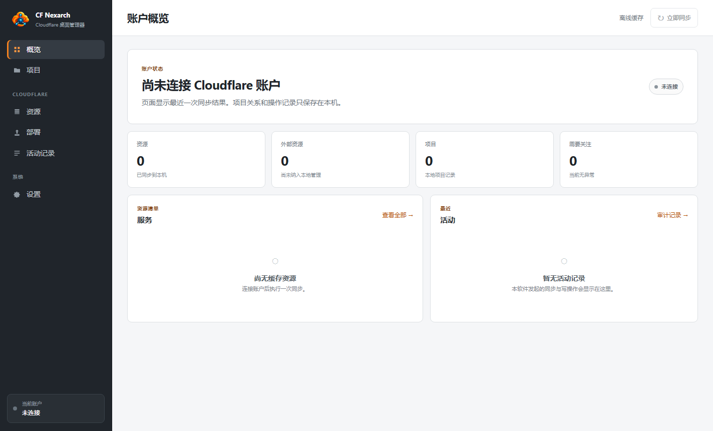

# CF Nexarch

> **专为 Windows 打造的本地 Cloudflare 综合控制台。**

[简体中文](README.md) | [English](README.en.md) · [下载最新 Release](https://github.com/rowanjove/cf-nexarch/releases) · [反馈问题](https://github.com/rowanjove/cf-nexarch/issues)

CF Nexarch 是一款基于 Electron 的 Windows 本地桌面应用。它将复杂的 Cloudflare 网页端管理浓缩为一个流畅敏捷的本地控制面板：资源一屏发现、本地 SQLite 高速缓存、项目结构纳管，以及带二次确认的安全部署流程，让你告别频繁刷新网页控制台的等待。



<details>
<summary><b>查看资源列表与部署向导截图</b></summary>

| 资源清单 | 部署向导 |
| :---: | :---: |
|  |  |

</details>

---

## 核心特性

* 🌐 **全资产一览 (Resource Discovery)**：
  一站式拉取并直观展示账号下的 **Pages、Workers、D1 数据库、KV 存储、R2 桶、DNS 解析及 Zones 域名**，资产状态一目了然。
* ⚡ **本地 SQLite 极速缓存**：
  将远端元数据安全保存在本机本地数据库中。开机秒开，告别网页仪表盘反复转圈的糟糕网络延迟。
* 🛡️ **安全严谨的部署流程**：
  集成 Pages Direct Upload 流程，部署前进行目录扫描、静态资源健康检查与目标环境二次确认，防止误操作覆盖已有生产环境。
* 🔐 **系统级安全凭据防护**：
  Cloudflare API Token 严格保存在系统的 **Windows Credential Manager** 中，绝不随日志落地或明文混入配置文件。

---

## 下载与使用

1. 从 [Releases 页面](https://github.com/rowanjove/cf-nexarch/releases) 下载最新的 `CF-Nexarch-x.x.x-windows-x64.zip`。
2. 完整解压 ZIP 压缩包，运行 `CF Nexarch.exe`。
3. 在“设置”中填入你的 Cloudflare API Token（建议遵循最小权限原则），点击连接即可开始同步管理。

---

## 本地开发

需要 Node.js **>= 22.14** 与 Windows 环境：

```powershell
# 克隆仓库
git clone https://github.com/rowanjove/cf-nexarch.git
cd cf-nexarch

# 安装依赖并启动
npm ci
npm run dev

# 运行构建
npm run build
```

---

## 开源协议

本项目采用 [MIT License](LICENSE) 开源。
